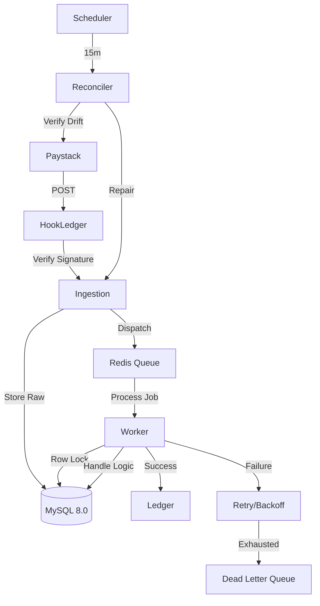

# HookLedger

Production-grade webhook reconciliation engine for financial systems.

## Architecture

## ADRs

### ADR 001: Idempotency via Unique Constraints
**Decision:** Use a composite unique key `(provider, event_id)` at the database level.
**Rationale:** Application-level checks are prone to race conditions. The database is the final source of truth for event uniqueness.

### ADR 002: Pessimistic Locking during Processing
**Decision:** Use `lockForUpdate()` inside a database transaction during job execution.
**Rationale:** Prevents multiple queue workers from processing the same event simultaneously if retries or delays cause overlaps.

### ADR 003: Push-Pull Reconciliation Model
**Decision:** Combine real-time webhooks (Push) with a scheduled API poller (Pull).
**Rationale:** Webhooks are "best-effort". Silent drops occur due to network partitions or provider downtime. Pull-based verification closes the integrity loop.

## Targets (not yet measured)

- Ingestion Latency (p95): < 15ms
- Recovery Time Objective: < 15m
- Data Integrity: 100.0%

## Failure Modes

- **Database Partition**: Ingestion fails (500) if primary DB is unreachable (Transactional Inbox requirement).
- **Redis Saturation**: Webhooks are ingested but processing lags behind.
- **Provider API Outage**: Reconciler retries until service is restored.
