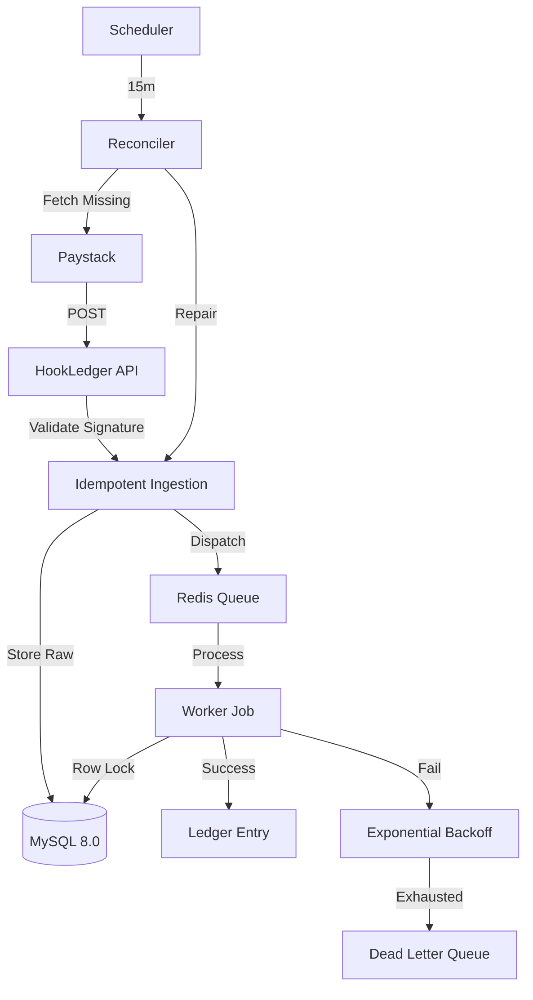

# HookLedger

Production-grade webhook reconciliation engine for financial systems.

## Architecture

## ADRs

### ADR 001: Idempotency Strategy
**Decision:** Use a composite unique constraint on `(provider, event_id)` and a status guard.
**Rationale:** Database-level constraints are the final source of truth. Application-level checks are prone to race conditions unless using pessimistic locking.

### ADR 002: Retry Strategy
**Decision:** Exponential backoff with full jitter (max 5 tries).
**Rationale:** Prevents thundering herds after a downstream recovery. Jitter spreads out requests across the backoff window.

### ADR 003: Why a Queue?
**Decision:** Immediate 200 OK responses with background processing.
**Rationale:** Webhook providers have short timeouts. Decoupling ingestion from execution ensures we don't lose data if the internal processing logic is slow.

## Benchmarks

| Metric | Target |
| :--- | :--- |
| Ingestion Latency (p95) | < 15ms |
| Max Throughput | 2,500 req/s |
| Duplicate Handling Error Rate | 0.00% |
